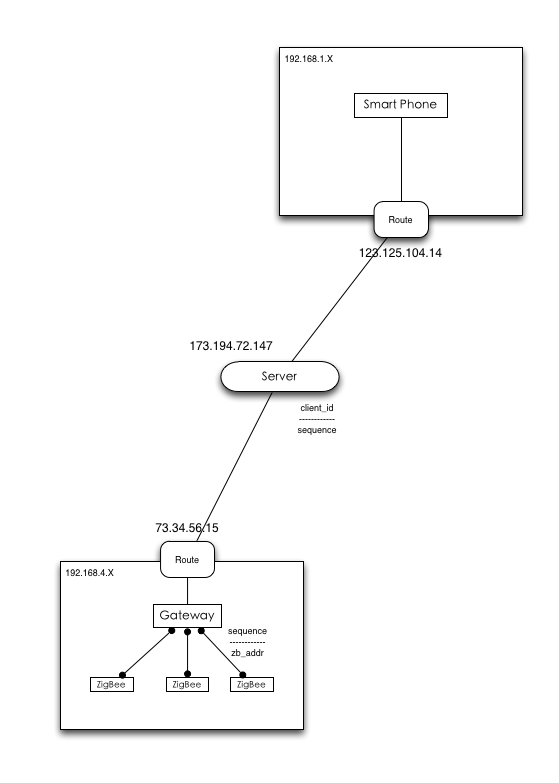
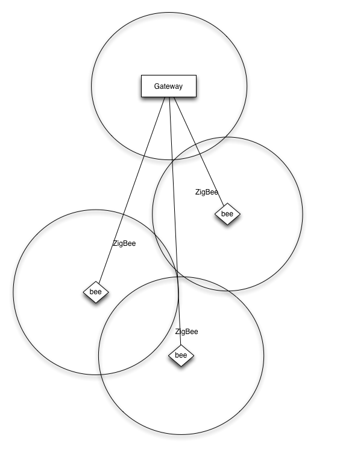

# Specification

## 整体架构

整套方案主要包含四个部分, 和图的对应关系如下.

* 云端 - 对应下图的Server
* 客户端 - 对应下图Smart Phone
* 网关 - 对应下图的Gateway
* 通讯板 - 对应下面的ZigBee

## 云端
提供网络接入能力, 允许客户端接入到对应的网关设备, 和网关进行通讯. 基本只是个鉴权+路由的角色, 对硬件无要求, 普通服务器.

## 客户端
提供UI, 供用户登陆到云端, 对帐号下归属的网关以及网关管理的电器进行管理.

目前仅有Android客户端.

## 网关
云端和通讯板设备之间的桥梁. 通讯板只和网关通讯, 接受来自网关的各种指令, 并上报自己的状态.

网关本身是类似一个路由器的设备, 仅仅是一个可以运行OpenWRT系统的单板, 拥有一个网口(后面会增加无线网卡), 以及和通讯板的定制接口(串口). 工作时需要插入网线和一块通讯板(和设备的通讯板单独设置以区分), 设备的通讯板需要连接并注册到网关. 由于可以同时连接互联网和多块通讯板组成的网络, 网关可以充当手机和通讯板之间的桥梁. 而由于ZigBee协议的自组网特性, 可以比较有效的组建无线家庭网络.

由于网关运行着一个完整的操作系统, 在上面可以做很多转发之外的工作, 包括但不限于

* 设备监控
* 设备控制功能扩展(比如定时开启/关闭设备)
* 挂个存储做NAS等小玩意儿
* ...

下图为通讯板通过自组网的方法, 组建足够大的家庭网络.

## 通讯板
和网关进行连接的通讯模块, 通过ZigBee协议, 自组网. 每个通讯板同时是一个独立的工作节点, 同时也能作为其他节点的中继, 这样可以在不需要布线的情况连通网关和整个家庭里所有的通讯模块. 通讯板提供一套自定义硬件接口, 只要能够和这些接口对接, 就能直接被网关管理.

## 控制协议
网关和通讯板之间的协议仅使用简单的set/get, get可以获取设备的状态, set可以设置设备的状态, 通过定义不同的功能ID, 组合即可完成所有的功能.

